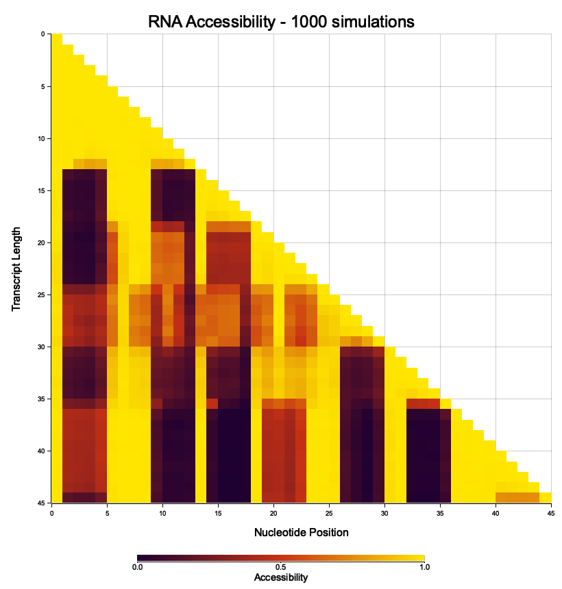

# Accessibility Analysis During Cotranscriptional Folding

## Overview 

This tool analyzes nucleotide accessibility in secondary structure ensembles during cotranscriptional RNA folding simulations. 

Accessibility is defined as how often in the performed simulations a nucleotide is unpaired at a given transcript length. 

## Input files

The file `dld3.fa` contains a designed RNA sequence:

```fasta
>dld3.fa
UCAGUCUUCGCUGCGCUGUAUCGAUUCGGUUUCAGUUUUUAUUGC
```

The simulation always starts from transcript length = 1 and the initial structure ".". 

---

## Input parameters:

The parameter --t-ext defines the simulation time per transcript length. To express simulation time in seconds, set the rate constant `k0` to `1e6`. 

## Simulation setup

> **Note:** Ensure the `fuzzyfold` package is installed.  
> When working directly from the Git repository, use  
> ```bash
> cargo run --bin ff-accessibility -- [options]
> ```  
> instead of calling `ff-accessibility` directly.

To simulate 100 trajectories with an extension time of 0.02 and build the corresponding accessibility profile:

```bash
cat dld3_lm3.fa | ff-accessibility --macrostates dld3*.ms --k0 1e6 --t-ext 0.02 -n 100
```

or equivalently:

```bash
ff-accessibility--k0 1e6 --t-ext 0.02 -n 100 < dld3_lm3.fa
```

To view all available options:

```bash
ff-accessibilty --help
```
During execution, the program prints simulation parameters to `STDOUT`,
and displays a **progress bar** once all runs are completed.  
The accessibility profile is generated automatically as a PNG file. 
The output file name ca be specified via `--output`. If not provided, the default name is accessibility_profile.png. 


An example output file from 1000 aggregated simulations of runs with an extenstion time of 0.02s may look like this:


