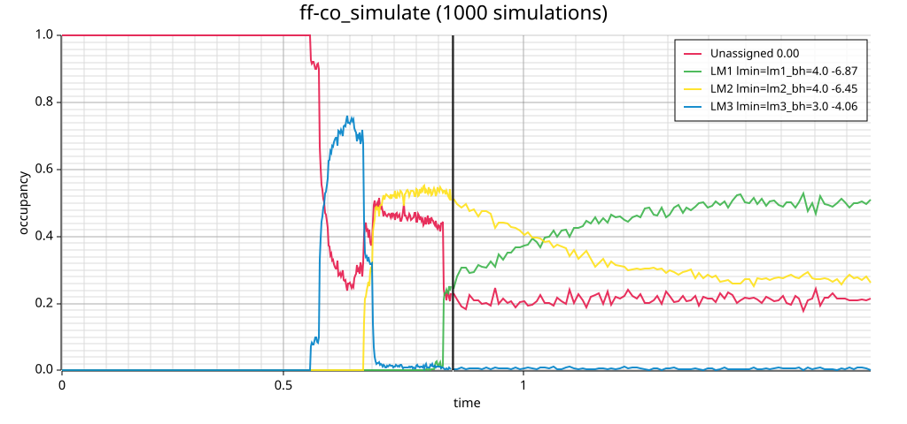

# Analyze changes of secondary-structure ensembles during transcription over time 

## Overview 

`ff-timecourse_cotranscriptional_folding` simulates co-transcriptional RNA folding. The program extends the sequence nucleotide by nucleotide and performs a stochastic kinetic folding simulation for each transcript length. The simulations start from transcript length 1 with the initial structure ".". Macro-state occupancies are recorded over time and visualized. 

## Input files

The file `dld3.fa` contains a designed RNA sequence:

```fasta
>dld3.fa
UCAGUCUUCGCUGCGCUGUAUCGAUUCGGUUUCAGUUUUUAUUGC
```
---

### Macro-states

To partition the overall secondary-structure ensemble into smaller ensembles of
interest, we define **macro-states** using files such as `dld3_lm*.ms`.

Example (`dld3_lm3_3.0.ms`):

```fasta
>LM3 lmin=lm3_bh=3.0
UCAGUCUUCGCUGCGCUGUAUCGAUUCGGUUUCAGUUUUUAUUGC
.((((....)))).((((........))))...............
.((((....)))).((((.(....).))))...............
.((((....))))..(((........)))................
.((((....)))).((((.(.....)))))...............
.(((......))).((((........))))...............
..(((....)))..((((........))))...............
.(((......)))..(((........)))................
.(((.(...)))).((((........))))...............
```

Here:
- The first line defines the **macro-state name** (`LM3`) and, optionally, some more description after a white-space (`lmin=lm3_bh=3.0`).
- The second line specifies the **sequence**.
- The remaining lines list all **secondary structures** that belong to this macro-state.

---
## Input Parameters

You can specify the transcription rate via the extension time (`--t-ext`), which defines the simulation time per transcript length. The posttranscriptional folding time (`--t-end`) defines the simulation time at full sequence length. To express simulation time in seconds, set the rate constant `k0` to `1e6`. 
Furthermore, you can specify timeline parameters:
- `--t-lin`: number of linearly spaced time points recorded per transcript length 
- `--t-log`: number of logarithmically spaced time points recorded during posttranscriptional folding.
To further familiarize yourself with the parameters:

```bash
ff-timecourse_cotranscriptional_folding --help
```

## Simulation setup

> **Note:** Ensure the `fuzzyfold` package is installed.  
> When working directly from the Git repository, use  
> ```bash
> cargo run --bin ff-timecourse_cotranscriptional_folding -- [options]
> ```  
> instead of calling `ff-timecourse_cotranscriptional_folding` directly.

To simulate 100 trajectories starting at transcript length 1:

```bash
cat dld3.fa | ff-timecourse_cotranscriptional_folding --macrostates dld3*.ms --k0 1e6 --t-lin 10 --t-log 100 --t-ext 0.02 --t-end 1.0 -n 100
```

or equivalently:

```bash
ff-timecourse_cotranscriptional_folding --macrostates dld3*.ms --k0 1e6 --t-lin 10 --t-log 100 --t-ext 0.02 --t-end 1.0 -n 100 < dld3.fa
```

During execution, the program prints simulation parameters to `STDOUT`,
displays a **progress bar**, and outputs **time-course data** once all runs are
completed.  The time course is also plotted automatically as an SVG file, 
where the plot name is derived from the input file. For example:

```
ff_dld3.svg
```

---

## Aggregating data from multiple simulations

To reduce statistical noise in ensemble dynamics, you may want to perform
**many more trajectories**, potentially for longer time periods.  You can
*accumulate results incrementally* by reloading existing timelines.

For example:

```bash
cat dld3.fa | ff-timecourse_cotranscriptional_folding --macrostates dld3*.ms --k0 1e6 --t-lin 10 --t-log 100 --t-ext 0.02 --t-end 1.0 -n 100 --timeline my_dld3.tln
```

This command creates `my_dld3.tln`, which stores the results from 100
simulations.  Running the same command again will automatically reload the
file, add another 100 simulations, and update the stored timeline accordingly.

Try it! This is the recommended way to extend your simulation dataset without
restarting from scratch.

An example output file from 1000 aggregated simulations with the following parameters: --k0 1e6 --t-lin 10 --t-log 100 --t-ext 0.02 --t-end 1.0 may look like this:



